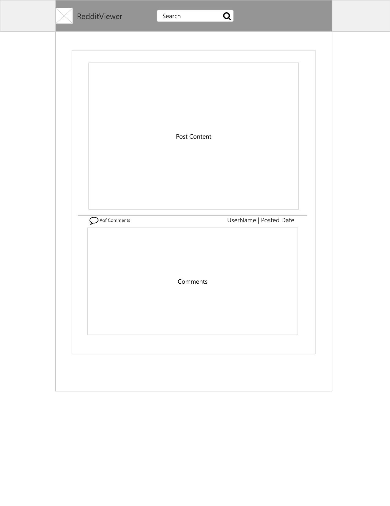

# Reddit Viewer

A simple read-only reddit web viewer app built with React.

[Click here to check it out live!](https://jamzzy.github.io/reddit-viewer)

## Table Of Contents
* [Introduction](#Introduction)
* [Technologies](#Technologies)
* [Wireframe](#Wireframe)
* [Implementation](#Implementation)
* [Testing](#Testing)

### Introduction

This reddit viewer was created to practice and further learn the React front-end library, Redux, APIs, and testing. Users are able to view content from different subreddits, filter posts, and read comments.

### Technologies
Project is created with:
* HTML 5
* CSS 3
* React 18.2
* Redux Toolkit 1.8.4

### Wireframe

The UI was conceptualized through simple wireframing. Below was the wireframe the app was based on. 



### Implementation

This project was bootstrapped with [Create React App](https://github.com/facebook/create-react-app).

The app was created with React front-end library and Redux Toolkit to manage state. 

Reddit data was obtained through Reddit's api, more specifically their json api. Content in reddit is accessible in json form if you append ".json" to the url. For example, ```https://www.reddit.com/r/wholesomememes/.json```, will return the r/wholesomememes data in json.

### Testing

Through the testing library, and jest, unit testing was implemented for most components in the app. Integration tests were implemented for components that interact with the redux store, such as Posts, and Comments. Instead of mocking the store, an instance of the actual store was used in testing. This meant being able to test the component UI and the app's real redux store logic.